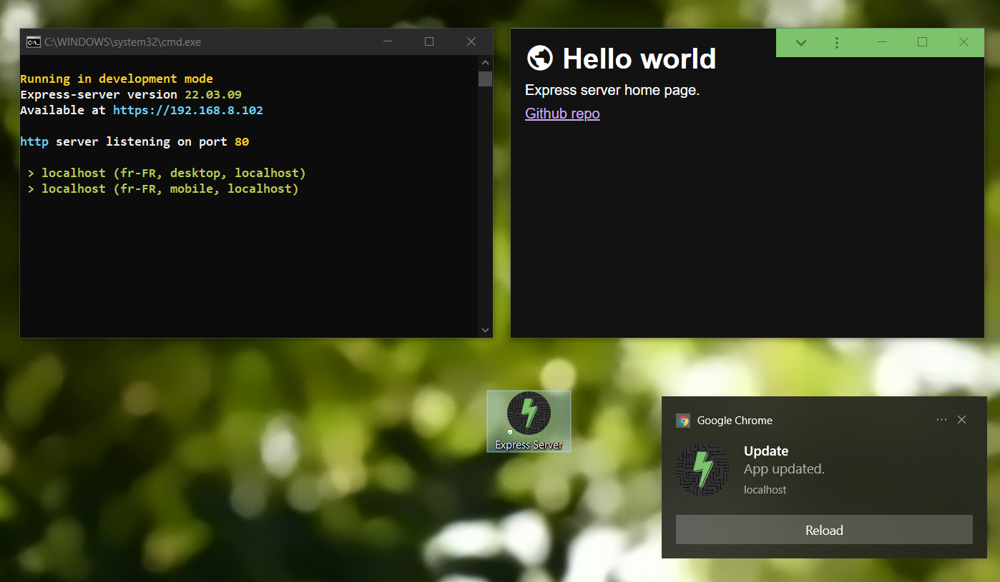

# Express Server

### A template repo for quick express.js node server setup with:

-   Several useful NPM scripts:
    -   `start`: Starts server with node.
    -   `start:nodemon`: Starts server with nodemon with `/private` folder ignored to prevent unwanted restart.
    -   `start:dev`: (Windows) Starts nodemon server, SASS compiler, Google Chrome at `localhost` and File Explorer in work folder.
    -   `start:prod`: Starts server with PM2 as "express-server" and shows raw logs.
    -   `update:prod`: Git resets hard and pulls then installs NPM dependencies, flushes PM2 logs and restarts all PM2 processes.
    -   `new:component`: Create new custom HTML5 element with:
        -   A JavaScript file with a basic custom  element class and registration with given name.
        -   An empty SCSS file for the component.
        -   All references to the new files in `public/index.html`.
    -   `sass` Starts sass compiler with no source map watching for `public/styles/scss` to `public/styles/css`.
    -   `logs`: Shows raw PM2 logs of current project server.
-   HTTP server listening to port 80 by default or to corresponding port written in proxy `config.json` file.
-   A dedicated SSL cert folder used by the HTTPS RedBird proxy.
-   A `route` function with basic express routes.
-   All desired express libraries and middelwares for `POST` requests JSON body, `useragent`, file upload, and URL params.
-   Colored logs with duplication count suffix (e.g. `'Hello world x2'`).
-   A basic middleware providing:
    -   Colored connection logs.
    -   Connections restricted to `localhost` and the domain specified in manifest
-   `tasks.json` and `launch.json` configs to run NPM `start:dev` script when starting a debugging session.
-   Basic manifest and service-worker.

## Usage

First, install the dependencies using this command:

    npm install

Then, create a `.env` file in the project folder using this pattern:

    NODE_ENV=development
    LOG_CONNECTIONS=1

Then update `package.json` to suit your project (description, name, domain...).

This template is made for a PWA but by removing `./public/swclinet.js` and `./public/service-worker.js` (including in `./public/index.html`) you can use it as a simple website.

In production, the server is intended to work with this [proxy](https://github.com/Iconejey/proxy) based on [RedBird](https://www.npmjs.com/package/redbird) package.
